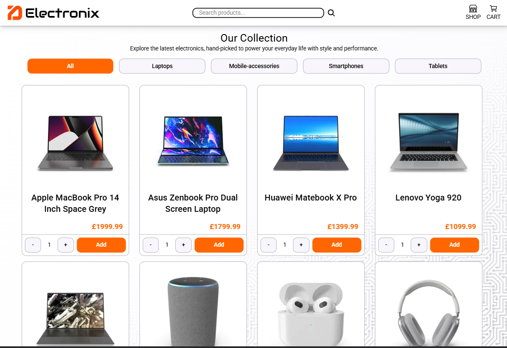

# Electronix Store Front

A demonstration of an e-commerce front-end written in React.



https://electronix-shop.netlify.app/

## Overview

This is a portfolio demonstration front-end written in typescript and React. It demonstrates all the features you would expect from an e-commerce website. React Router was utilised over Next.js to showcase understanding. 

## Setup

```bash

git clone https://github.com/Liam-JL/electronix-storefront-refactor.git

cd repo

npm install

npm run dev

```

## Features

- Landing Page with featured products carousel
- Product search functionality
- Cart tracking across app
- Store categorisation filters
- Product card display in store
- Unique pages for each product
- Basic CRUD functionality for products and cart

## Tech
- React
- Typescript
- Tailwind CSS
- React Router


## License

MIT

# Demo Video
TBI
